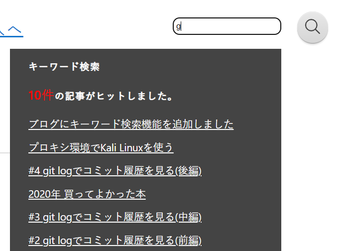

# ブログにキーワード検索機能を追加した

タイトルのまんまです。右上にある虫眼鏡ボタンをクリックすればテキストボックスが現れ、キーワードによる記事の絞り込み検索が可能です。絞り込み検索はインクリメンタルサーチとも呼ばれますね。

このブログは既にシリーズ検索とタグ検索の機能を持っており、これ以上の検索機能は不要かと思ったのですが、年末年始が非常に暇だったこともあり実装しました。

この記事では検索機能について、そしてその実装方法を解説します。

## JSONファイルから検索する

さて、静的サイトでの検索機能といえば[algolia](https://www.algolia.com/)が真っ先に思い浮かびますね。私も利用しようと思って色々調べてみたのですが、

- 🤔 algoliaに関する知識が全くない
- 🤔 料金がかかるかもしれない 
- 🤔 Sassを利用するのは大げさ
- 🤔 全文検索は必要ない

などの理由から導入はしないことにしました。

ではどうやって実装するかと言うと、「全文検索は必要ない」との理由から、Gatsbyのビルドプロセス時に各記事のfrontmatterからJSONファイルを作成し、コンポーネントからJSONファイルを検索する、というなんとも至極シンプルな方法をとることにしました。

## frontmatterにkeywordを追加する

次に、検索対象をどうしようかと考えました。ぱっと思いつくのは

- 🔍 記事のタイトル
- 🔍 シリーズ名
- 🔍 タグ
- 🔍 description
- 🔍 記事本文（全文検索）

くらいですが、全てを対象にするとロジックが複雑になるうえ（実際に複雑になりました）JSONファイルも非常に肥大化するのでやめました。記事本文もJSONファイルの肥大化、そしてそこまで必要ないという理由で却下。シリーズ名、タグ名による検索もほぼ同じ機能が既にあるので却下。タイトルやdescriptionは検索対象としては情報量が不足するということで却下。

いくつかの要素を組み合わせようかとも思いましたが、グタグタ考えるくらいならfrontmatterに新しい項目を追加してしまおうということで、「keyword」という項目を追加しました。配列にして各キーワードを記述していきます。

追加する言葉ですが、「タグよりも粒度の細かい言葉」にしました。タグにするほどではないけど本文に何回か出現する言葉ですね。タグと本文の中間くらいのイメージです。

また、「Blog」「ブログ」などの日本語/英語のゆれ、「SSG」「Static Site Generator」などの略す略さないというゆれはタグ検索では実現しにくいです。機能を追加する利点、モチベーションになると思い、面倒臭いですが細かに記述していきます。

```yaml
---
# 例えばこんな感じ
keyword: ["Gatsby", "Blog", "ブログ", "SSG", "Static Site Generator"]
---
```

## ビルド時にJSONファイルを書き出す

各記事に`keyword`を用意したら、JSONファイルを書き出す機能を実装します。Gatsbyのビルドプロセス時にJSONファイルを生成するので、編集するのは`gatsby-node.js`ですね。

まずは、全ての記事の`frontmatter`の`keyword`項目を取得するGraphQLクエリーを追加します。

```typescript:title=gatsby-node.ts
const createPages: GatsbyNode['createPages'] = async ({ graphql, actions, reporter }) => {

  const queryResult = await graphql(
    `
      ...略
      {
        # 全ての記事を取得(検索用)
        allArticlesForSearching: allMarkdownRemark(
          sort: {fields: frontmatter___postdate, order: DESC}
        ) {
          edges {
            node {
              fields {
                slug
              }
              frontmatter {
                keyword
                title
              }
            }
          }
        }
      }
    `
```

JSONファイルの書き出しは以下のように行います。ファイルの保存先はルート直下の`static`にしました。

```typescript:title=gatsby-node.ts
  const keywords = queryResult.data.allArticlesForSearching.edges.map(({node}) => {
    return {
      slug: node.fields.slug,
      title: node.frontmatter.title,
      keyword: node.frontmatter.keyword,
    }
  })

  fs.writeFileSync('./static/search.json', JSON.stringify(keywords, null , 2))
```

試しに`gatsby develop`してみると、`/static/search.json`が生成されおり、JSONファイルは以下のようになっているはずです。

```json
[
  {
    "slug": "/Others/01/",
    "title": "プロキシ環境でKali Linuxを使う",
    "keyword": [
      "Kali Linux",
      "WSL2",
      "Proxy",
      "プロキシー",
      "apt",
      "wget",
      "curl"
    ]
  },
  //...略
]
```

## gatsby-transformer-jsonをインストールする

JSONファイルを生成できたので、次はこれをコンポーネントから取得します。`gatsby-transformer-json`というパッケージが用意されており、これを使うことでGraphQLクエリーでJSONファイルを取得できます。早速インストールしましょう。

なお、`gatsby-transformer-json`は、2022年1月現在、`^4.4.0`が最新なようですが、Gatsby v3を使用している環境だと「warn Plugin gatsby-transformer-json is not compatible with your gatsby version 3.12.1 - It requires gatsby@^4.0.0-next」みたいなエラーが出るはずです。

v4を使用しているのであれば問題ありませんが、v3を使用中の方は`v3.0.0`をインストールしましょう。

```shell
$ yarn add gatsby-transformer-json@^3.0.0
```

インストールできたら、まずは`gatsby-config.js`のプラグインの部分に追記します。

```javascript
module.exports = {
  plugins: [
    `gatsby-transformer-json`,
    // ...略
  ]    
```

また、`/static/search.json`を扱うわけですから、`gatsby-source-filesystem`に`static`への設定を行う必要があります。設定が出来ていない場合は以下のように追記します。

```javascript
  {
    resolve: `gatsby-source-filesystem`,
    options: {
      path: `static`,
      name: `search`,
    },
  },
```

この段階で`gatsby develop`を行い、`localhost:8000/___graphiql`にアクセスし、GraphQL PlaygroundでJSONファイルを取得できるかを確認してみます。

JSONファイルを取得するクエリーの名前ですが、`static`に保存しているJSONファイルのファイル名が踏襲されます。今は`**search**.json`を保存しているので、`allSearchJson`ないし、`searchJson`というクエリーが用意されているはずです。



GraphQLクエリーは以下のように投げます。肝心の`keyword`と、検索でヒットした記事へのリンクを作成するために`slug`と`title`も必要です。

```graphql
{
  allSearchJson {
    edges {
      node {
        keyword
        slug
        title
      }
    }
  }
}
```

クエリーを実行して、右側のペインにエラーなく結果が表示されればOKです。以下は筆者の環境でのクエリーの結果です。

```javascript
{
  "data": {
    "allSearchJson": {
      "edges": [
        {
          "node": {
            "keyword": [
              "Kali Linux",
              "WSL2",
              "Proxy",
              "プロキシー",
              "apt",
              "wget",
              "curl"
            ],
            "slug": "/Others/01/",
            "title": "プロキシ環境でKali Linuxを使う"
          }
        },
        //...略
      ]
    }
  }
}
```

## コンポーネントを作成する

ここまでくれば目的の大半は達成したも同然です。記事を検索するコンポーネントを作成しましょう。`/src/components/search.tsx`を用意します。まずは以下のように記述しておきます。

```tsx
import * as React from "react"

const Search = () => {
  return (
    <p>This is a search component</p>
  )
}

export default Search
```

次に、GraphQLクエリーを記述します。コンポーネントからクエリーを投げるわけですから、`useStaticQuery`を利用します。`useStaticQuery`と`graphql`をインポートし、以下のように記述します。適当な所に`console.log(allSearchJson)`を仕込み、結果を確認できるようにしておきます。


```typescript{2}:title=src/components/search.tsx
import * as React from "react"
import { useStaticQuery, graphql } from "gatsby"

const Search = () => {
  const { allSearchJson } = useStaticQuery(
    graphql`
      query {
        allSearchJson {
          edges {
            node {
              keyword
              slug
              title
            }
          }
        }
      }
    `
  )

  console.log(allSearchJson)

  return (
    <p>This is a search component</p>
  )
}

export default Search
```

ファイルができたら、適宜`src/components/layout.tsx`などにコンポーネントを追記します。`gatsby develop`でローカルサーバーを起動し、ページにアクセスしコンソールで結果を確認します。


UIの作成にはuseStateとuseEffectを使用します。入力された文字列を保持するフックと、条件によって絞り込まれた記事すべてを保持するフックを用意します。

ついでに入力フォームも書いておきましょう。

```tsx
const Search = () => {

  // ...略

  // フォームに入力された文字列を保持するフック
  const [inputedKeyword, setInputedKeyword] = useState("")

  // 条件によって絞り込まれた記事を保持するフック
  const [filteredPosts, setFilteredPosts] = useState(null)

  return (
    <input type="text" />
  )
}
```

今回はインクリメンタルサーチですから、入力ボックスに1文字入力されるたびにJSONファイルを走査して結果を書き換える必要があります。

まずはinput要素に`onChange`属性を定義し、入力された文字列を`setInputedKeyword`に渡すようにします。

```tsx
  return (
    <input
      type="text"
      onChange={(e) => setInputedKeyword(e.target.value)}
    />
  )
```

続けて、`useEffect`を定義し、第二引数に`inputedKeyword`を渡します。これで入力フォームに書き込まれるたびに`useEffect`が実行される状態になりました。`useEffect`には`console.log(inputedKeyword)`などと記述し、フォームに1文字入力されるたびにコンソール出力されることを確認してください。

```tsx
const Search = () => {
  // ...略

  // フォームに文字列が入力されるたびに実行される
  useEffect(() => {
    console.log(inputedKeyword)

    // ここにinputedKeywordの中身を使ってJSONファイルを走査し、
    // filteredPostsを書き換える処理を書く

  }, [inputedKeyword])

  return (
    <input
      type="text"
      // 入力された文字列でinputedKeywordを更新する
      onChange={(e) => setInputedKeyword(e.target.value)}
    />
  )
}

export default Search
```

それでは`useEffect`の処理を記述します。まずは入力された文字列を全て小文字に変換し、`slowerKeywords`といった変数に保管します。

```tsx
  useEffect(() => {
    const searchKeywords = inputedKeyword
      .trim()
      .toLocaleLowerCase()
      .match(/[^\s]+/g)
  }, [inputedKeyword])
```

