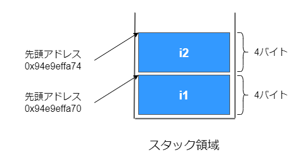
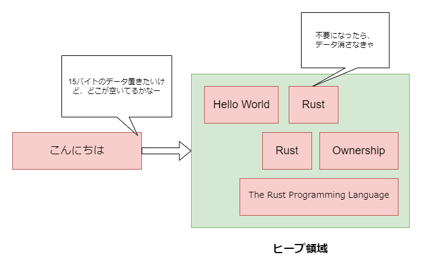
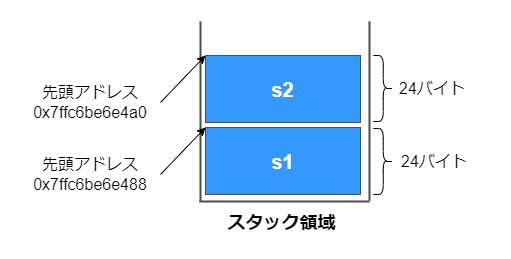
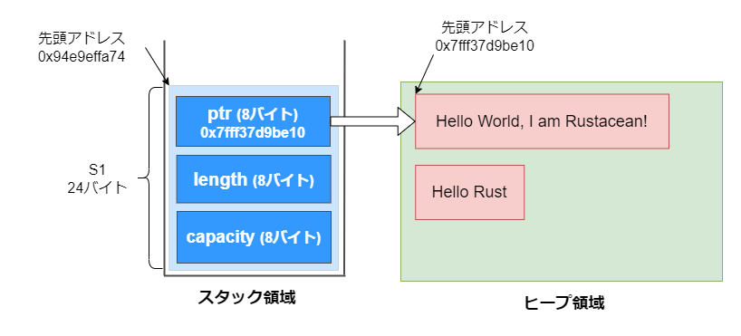
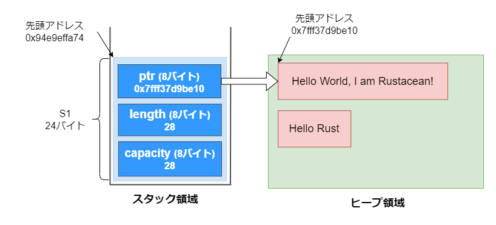
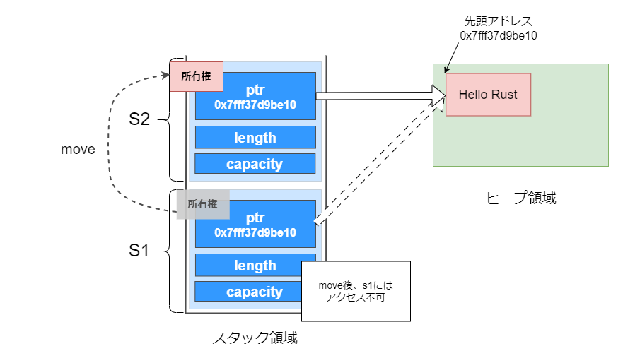

# 所有権なんか知らん

Rustにおける**所有権**とは、**メモリーを安全に管理するため**の機構です。メモリーに保存された値には**所有者**と呼ばれる変数が設定されます。所有者はある一時点において必ず一人（つまり一つの変数）であり、所有者がスコープから外れるなど不要になったら、所有者がメモリー上の値を破棄します。

```rust:title=main.rs
fn main() {
    // メモリーに「Hello Rust」という文字列が格納される
    // 文字列「Hello Rust」の所有者は変数str
    let str = String::from("Hello Rust");
    println!("greeting : {}", str);
}
// 所有者であるstrがスコープを抜けることで、メモリーの「Hello Rust」が破棄される
```

この所有権についてざっと調べてみましたので記事にします。所有権とは直接関係ない所へ話が逸れている箇所が点在しています。また、初学者の学習メモで微妙に分かっていない部分もありますがその辺は悪しからず 🦀💦 ｺﾞﾒﾝﾈ。

## メモリー

所有権の話には**メモリー**が絡んできますので、まずはそこから学習します。

Rustはメモリーを以下のように大別し利用します。

- ① 静的領域
- ② テキスト領域
- ③ スタック領域
- ④ ヒープ領域

①の静的領域には、グローバル変数や文字列リテラルが格納されます。また、②のテキスト領域には、コンパイル時に生成されたバイナリーコードが格納されます。静的領域とテキスト領域は今回のお話には登場しないので忘れることにします。

③のスタック領域には、関数内のローカル変数など**コンパイル時点で必要なメモリーのサイズが判明する**データが格納されます。スタック領域はいわゆる**後入れ先出し方式**でデータを管理しており、容量は限られているものの高速なアクセスが可能です。このスタック領域も今回のお話ではそんなに登場しません。

そして、残る④の**ヒープ領域**には、**コンパイル時に必要なメモリーのサイズが分からない**データが格納されます。例えば`String`や`Vec`などがそれにあたります。

## スタック領域

繰り返しになりますが、スタック領域には**コンパイル時**に必要なメモリー領域のサイズが分かるデータを格納するのに対し、ヒープ領域には**実行時に**必要なサイズが分かる（裏を返せばコンパイル時にサイズが分からない）データを格納します。

スタックは**積み上げ**などと訳されますが、以下の画像のような細い箱のイメージです。スタック領域にデータを保存するときは1番上に積み上げます。データを取り出す時は1番上から取り出します。


今回の記事のテーマとは直接関係ありませんが、Rustにおいてスタックにデータが積まれるというのがどのような感じか、試してみたいと思います。

---

Rustでは、データ型によってデータがスタックに積まれるかヒープに格納されるかが決まります。スタックに積まれるデータ型として、今回は数値を表す`i32`と`f64`を例にとります。

`i32`は32bit、つまり4バイトでデータを表現します。以下のように変数に値を束縛すれば、型推論が働き`i1`と`i2`は共に`i32`型となります。

```rust
fn main() {
    // 共にi32型
    let i1 = 1;
    let i2 = 2;
}
```

このコードであれば、`i1`→`i2`の順でスタックに積まれます。


これらの変数が積まれているスタックのアドレスは、以下のようにして出力します。変数名に`&`をつけることでそのデータの先頭アドレスを得ることができます。また、`println!`では`{:p}`とすることでポインターの形で整形し出力することができます。

```rust:title=main.rs
fn main() {
    let i1 = 1;
    let i2 = 2;

    println!("1: 変数i1のスタック上のアドレス : {:p}", &i1);
    //=> 1: 変数iのスタック上のアドレス : 0x94e9effa70

    println!("2: 変数i2のスタック上のアドレス : {:p}", &i2);
    //=> 1: 変数i2のスタック上のアドレス : 0x94e9effa74
}
```

実際に出力される値は、その時々によって変わることに注意します。さて、アドレスの末尾に注目すると、`i1`が`70`、`i2`が`74`となっていて、4バイトのずれがあることが読み取れます。上記のコートで取得できるアドレスは、正確にはデータの先頭アドレスを指しているため、これを図解すると以下のようになっていると考えられます。



続いては`f64`を試します。`f64`は64bit、つまり8バイトでデータを表現します。`i32`の時のようにアドレスを出力すると、アドレスに8バイトのずれがあることが予想されます。

```rust
fn main() {
    // f64と推論される
    let f1 = 1.0;
    let f2 = 2.0;

    println!("3: 変数f1のスタック上のアドレス : {:p}", &f1);
    //=> 2: 変数f1のスタック上のアドレス : 0x72909bf4d8

    println!("4: 変数f2のスタック上のアドレス : {:p}", &f2);
    //=> 2: 変数f2のスタック上のアドレス : 0x72909bf4e0
}
```

今回は`f`の末尾が`d8`、`f2`の末尾が`e0`という結果になりました。16進数なのでちょっと分かりにくいですが、`e0 - d8`を計算すると10進数で`8`になります。


続いて、配列も取り上げます。Rustにおいて配列は変更不可であり、それゆえコンパイル時にデータサイズが決まっており、それゆえ各要素が配列に積まれていきます。

```rust
fn main() {
    // [i32; 3]と推論される
    let arr = [1, 3, 5];

    for (index, num) in arr.iter().enumerate() {
        println!("配列arrの{}番目の値 {}", index + 1 , num);
        //=> 配列arrの1番目の値 1
        //=> 配列arrの2番目の値 3
        //=> 配列arrの3番目の値 5
    };
}
```

以下のようにして、スタックに積まれているデータのアドレスを得ることができます。

```rust
fn main() {
    let arr = [1, 3, 5];

    println!("配列arrの1番目の値のスタックアドレス {:p}", &arr[0]);
    println!("配列arrの2番目の値のスタックアドレス {:p}", &arr[1]);
    println!("配列arrの3番目の値のスタックアドレス {:p}", &arr[2]);
    //=> 配列arrの1番目の値のスタックアドレス 0x8d514ff814
    //=> 配列arrの2番目の値のスタックアドレス 0x8d514ff818
    //=> 配列arrの3番目の値のスタックアドレス 0x8d514ff81c
}
```

配列の各要素は`i32`型と推論され、4バイトで表現されます。私が実行すると、末尾が`14`、`18`、`1c`となりました。それぞれの差は4です。


---

スタックの**後入れ先出し**という性質上、「どこにデータを積むか」「いつどのデータを開放するか」といったことを考える必要はありません。その時々の「一番上」を表すアドレスをどこかに保存しておいて、そこに積んでそこから取り出せばよいです。それゆえ高速に処理でき、人間が考えてメモリーを管理する必要はありません。

## ヒープ領域

対するヒープ領域には、スタックの様な順序だてられた規則はありません。以下の図のように、その時に空いている場所を探し保存し、使い終わったら解放するイメージです。



逆に言うと、どのようなデータがどのようなタイミングでどこに保存されるか、そしていつ解放されるかがスタックのように機械的には分かりません。そのため、何らかの仕組みを使ってこのヒープ領域を管理する必要があります。これはとても難しそうですね。

### C

Cでは、プログラマーがコード上で`malloc`や`free`といった関数を用いてヒープ領域を確保/解放します。

`malloc`は「memory allocation」の略です。allocationは「割り当て」といった意味ですから、言葉通りメモリーの割り当てを行う、という関数ですね。

```c:title=C
char *p;
// ポインター変数pにはヒープ領域の先頭アドレスが格納される
p = malloc(20)
```

この「プログラマーが」というところがポイントで、適切にメモリー管理を行えないと**メモリーの多重開放**や**不正領域へのアクセス**など重大なエラーが発生します。「自由には責任が伴う」とは正にこのことですね。

例えば、Androidは大部分がC/C++で書かれていたようですが、**メモリー安全性に関する問題が脆弱性の多くを占めていた**ようです。

参考 : [Rustの採用が進んだ「Android 13」、メモリ破壊バグは減少、脆弱性の深刻度も低下傾向 - 窓の杜](https://forest.watch.impress.co.jp/docs/news/1462573.html)

ちなみにネタバレすると、Rustでは`malloc`や`free`などを用いてヒープ領域を管理することは基本的にできません（unsafeな処理が必要）。

### JavaScript

JavaScriptではガベージコレクション（以下、GC）という言語処理系の機構を用いて、ヒープ領域を管理します。例としてJavaScriptを挙げますが、近代のほとんどのプログラミング言語における実行環境では、GCを用いてヒープ領域を管理していると思われます。

Cのように、プログラマーが明示的にヒープ領域を確保/解放するという命令を出さなくても、GCがOSと協力してメモリーを管理してくれます。

参考 : [5分で分かるガベージコレクションの仕組み｜ITフリーランスをサポートする【geechs job(ギークスジョブ)】](https://geechs-job.com/tips/details/35)

「じゃあ全部の言語でGCにやらせたらええやん」となりそうですが、

- ・GCが走る分のコストがかかり、アプリケーションの実行速度が落ちたり、停止することさえある
- ・GCが走るタイミングは人間がコントロールできず、効率や速度の面で最良とは言えない

といったweak pointがあり、高いレイヤーで動作するアプリケーションでは問題なくとも、レイヤーが低くなるに伴い問題になることが増えていくと思われます。

ちなみにネタバレすると、RustではGCを用いてヒープ領域を管理することはできません。

<aside>

（何故か）Rustと対比されがちな**Go**もGCによってヒープ領域を管理しています。そういう意味ではGoはRustやCの代替になりえないことが分かります。

</aside>

### Rust

先述した通り、Rustは所有権という機構を使い、メモリーリソースの確保と解放を行います。プログラマーは所有権について意識する必要はありますが、ヒープ領域の確保と解放を明示的に行う必要はありません。

## 所有権

では所有権について、コードを書きながら確認していきます。所有権を司る仕組みが内部でどんな風に動いているかは私も勉強不足で分かりませんが、コードを書きながらその挙動を見ていきましょう。

```rust
fn main() {
    // 1. ヒープ領域に"Hello Rust"という文字列が格納される
    // 1. 変数s1が"Hello World"の所有者となる
    let s1 = String::from("Hello Rust");
} // 2. 変数s1がスコープから外れ、ヒープ領域の"Hello Rust"が破棄される
```

文字列を表すString型の例です。値`Hello Rust`が変数`s1`に束縛され、この時`Hello Rust`がヒープ領域に格納されます。同時に、`s1`が`Hello Rust`の所有者となります。

最終的に`s1`がスコープから外れた時点で、所有者である`s1`が責任を持ってヒープ領域の`Hello Rust`を破棄します。この仕組みならデータがずっとヒープ領域に残り続けることはありませんね。

しかも、人間が明示的に「`Hello Rust`を破棄しろ」と命令しているわけではなく、ソースコードの構造によって言語レベルでその処理が行われているところが素敵✨です。

## String型

ではここから所有権について掘り下げてみます。最初に、データがどのようにメモリーに格納されているかを確認してみます。

ヒープ領域にデータが格納されるデータ型として、先ほどと同じく`String`型を取り上げます。その名の通り、文字列を表すデータ型であり、以下のように定義します。

```rust
fn main() {
    let s1 = String::from("Hello World, I am Rustacean!");
    let s2 = String::from("Hello Rust");

    println!("s1の値 {}", s1);
    println!("s2の値 {}", s2);
}
```

さて、この`s1`と`s2`という変数（String構造体）は、ヒープ領域にある実データそのものではなく、実データを指している参照のようなものであり、スタックに積まれています。これも検証して図解してみます。

まずは、以下のようにして`s1`と`s2`のアドレスを確認します。

```rust
fn main() {
    let s1 = String::from("Hello World, I am Rustacean!");
    let s2 = String::from("Hello Rust");

    println!("s1のスタックアドレスの値 {:p}", &s1);
    //=> s1のスタックアドレスの値 0x7ffc6be6e488

    println!("s2のスタックアドレスの値 {:p}", &s2);
    //=> s2のスタックアドレスの値 0x7ffc6be6e4a0
}
```

アドレスの末尾、`a0` - `88`をしてみると、10進数で24であり、`s1`、`s2`は24バイトの容量を持っていると思われます。`s1`、`s2`はスタックに積まれているので、図解すると以下のようになります。



この24バイトの正体は何なのでしょうか？

---

結論から言うと、この24バイトは「ヒープ領域にある実データの先頭アドレスを指すポインター（8バイト）」「データ長（8バイト）」「ヒープ領域に確保された領域のサイズ（8バイト）」という内訳になっています。[The Book](https://doc.rust-jp.rs/book-ja/ch04-01-what-is-ownership.html#%E5%A4%89%E6%95%B0%E3%81%A8%E3%83%87%E3%83%BC%E3%82%BF%E3%81%AE%E7%9B%B8%E4%BA%92%E4%BD%9C%E7%94%A8%E6%B3%95-%E3%83%A0%E3%83%BC%E3%83%96)の中では以下のように図示されています。左がスタックに積まれている24バイト、右がヒープ領域にある実データを表現しています。最初の8バイト（`ptr`）がヒープ領域の実データの先頭アドレスを指しているのが分かると思います。

<div style="width: 60%">


</div>

ではこの図をもう少し分かりやすく書き換えてみます。最初の8バイト、つまりヒープ領域にある実データの先頭アドレスを指すポインターは、以下のように`as_ptr()`を使って表示します。

```rust
fn main() {
    let s1 = String::from("Hello World, I am Rustacean!");
    let s2 = "Hello Rust".to_string();

    println!("s1のスタックアドレスの値 {:p}", &s1);
    //=> s1のスタックアドレスの値 0x7ffc6be6e488

    println!("s1のヒープ領域の実データの先頭アドレス {:p}", s1.as_ptr());
    //=> s1のスタックアドレスの値 0x7fff37d9be10

    println!("s2のヒープ領域の実データの先頭アドレス {:p}", s2.as_ptr());
    //=> s2のスタックアドレスの値 0x7fff37d9be60
}
```

これを図示するとこうなります（`s1`のみ図示します）。



続いて、データ長を格納している8バイトは`len()`で取得できます。s1はスペースも入れて28文字、s2はスペースも入れて10文字なので、以下のような出力になります。

```rust
fn main() {
    let s1 = String::from("Hello World, I am Rustacean!");
    let s2 = String::from("Hello Rust");

    println!("s1の実データのデータ長 {}", s1.len());
    //=> s1の実データのデータ長 28

    println!("s2の実データのデータ長{}", &s2.len());
    //=> s2の実データのデータ長10
}
```

ちなみに、出力されるのはあくまで実データのデータ長であり、文字数をカウントしているわけではありません。Rustは文字列をUTF-8でエンコードしています。例えば`こんにちは`という文字列なら、1文字3バイトですので`15`が出力されます。

```rust
fn main() {
    println!("こんにちはのデータ長 {}", String::from("こんにちは").len());
    //=> こんにちはのデータ長 15
}
```

ちなみにのちなみに、`chars()`を用いれば以下のようにすれば文字数をカウントすることができます。

```rust
fn main() {
    println!("🦀 こんにちはの文字数 {}", String::from("こんにちは").chars().count());
    //=> 🦀 こんにちはの文字数 5
}
```

最後、ヒープ領域上に確保される領域は`capacity()`で取得できます。

```rust
fn main() {
    let s1 = String::from("Hello World, I am Rustacean!");
    let s2 = String::from("Hello Rust");

    println!("s1のヒープ領域に確保される領域のサイズ {}", s1.capacity());
    //=> s1のヒープ領域に確保される領域のサイズ 28

    println!("s2のヒープ領域に確保される領域のサイズ {}", s2.capacity());
    //=> s2のヒープ領域に確保される領域のサイズ 10
}
```

文字列のバイト数を増やしたりして何度か試しましたが、いずれも`len()`と`capacity()`の値は同じでした。`String`は後から変更可能なので、少し大きめに`capacity()`を持っておくのかも？と素人的に考えていましたが、そうでもないようです。

というわけでまとめると、String型は以下のようにスタック領域とヒープ領域にまたがっているデータ構造です。



`s1`がスコープから抜ける時に、`s1`がスタックから取り出されます。そしてその時、所有者である`s1`がヒープ領域のデータを責任を持って削除します。

## 所有権は移動する

記事の冒頭で「所有者はある一時点において必ず一人（つまり一つの変数）であり」と書きました。ここまでの知識を元に整理すると、「ある値が存在して、それに対応するたった一人の所有者が存在する。その所有者がスコープを抜けるなどしたら値も破棄される。値の破棄し忘れも起きないし、所有者が一人であるためメモリーの二重開放も起きない」という風に考えられ、所有者と値は一蓮托生の運命共同体のように捉えることができます。

話がこれで済めばいいのですが、しかし、この所有権というものは**他の変数に移動する**ことがあります。この所有権の移動を**move**と呼ぶことにします。

moveはいくつかの場面で起こりますが、以下のようにString型の変数を他の変数に束縛する状況を考えてみます。

```rust
fn main() {
    let s1 = String::from("Hello Rust");

    // moveが起きる
    let s2 = s1;
}
```

所有権の移動、とは文字通りの「移動」であり、コピーされるわけではありません。上記コードは問題なくコンパイルが通ります。ここで、所有権を失った`s1`にアクセスしようとするとコンパイルが失敗します。

```rust
fn main() {
    let s1 = String::from("Hello Rust");

    // moveが起きる
    let s2 = s1;

    println!("🦀❓ s1の値を出力できる?{}", s1);
}
```

コンパイルエラーが起こると、エラーメッセージが出力されます。しかし、Rustのエラーメッセージは感動するほど丁寧です。この丁寧さがなければ、私はとっくにRustを諦めていました。

```rust
    //エラーメッセージ
    error[E0382]: borrow of moved value: `s1`
    --> src/main.rs:7:34
    |
    2 |     let s1 = String::from("Hello Rust");
    |         -- move occurs because `s1` has type `String`, which does not implement the `Copy` trait
    ...
    5 |     let s2 = s1;
    |              -- value moved here
    6 |
    7 |     println!("🦀❓ s1の値を出力できる?{}", s1);
    |                                            ^^ value borrowed here after move
    |
  = note: this error originates in the macro `$crate::format_args_nl` which comes from the expansion of the macro `println` (in Nightly builds, run with -Z macro-backtrace for more info)
    help: consider cloning the value if the performance cost is acceptable
    |
    5 |     let s2 = s1.clone();
    |                ++++++++

    For more information about this error, try `rustc --explain E0382`.
```

`borrow of moved values: s1`という文言がありますが、「`s1`でmoveが起こったからborrow（借用）できないよ」という意味です。borrowという言葉は難しいですが、「所有権を失った変数にはアクセスできない」と捉えることにします。

今は`println!()`に`s1`を渡した所為でエラーが起きていますが、例えば他の変数に束縛するなどでも同様のエラーが発生します。所有権を失った後`s1`にはどんな形であれアクセスできない、と考えることができます。

```rust
fn main() {
    let s1 = String::from("Hello Rust");

    // moveが起きる
    let s2 = s1;
    // これ以降、s1にはアクセスできない

    let s3 = s1;
    // 同様のエラー
}
```

さて、`Hello Rust`という実体の所有権は`s2`に移っています。ですので`s2`には問題なくアクセスできます。

```rust
fn main() {
    let s1 = String::from("Hello Rust");

    // moveが起きる
    let s2 = s1;

    println!("s2の値を出力できる {}", s2);
    // Hello Rust
}
```

このmoveの動作をより理解するため、メモリーアドレスを出力しながら再度動作確認してみます。`s1`に値を束縛した後、`s1.as_ptr`でヒープ領域の`Hello Rust`が保存されているアドレスを出力します。`s2`に所有権が移った後、`s2.as_ptr()`という風に再度実体のアドレスを出力してみます。ともに同じアドレスを吐き出すはずです。

```rust
fn main() {
    let s1 = String::from("Hello Rust");

    println!("s1のas_ptrの値 {:p}", s1.as_ptr());
    //=> s1のas_ptrの値 0x7fff37d9be10

    let s2 = s1;

    println!("s2のas_ptrの値 {:p}", s2.as_ptr());
    //=> s2のas_ptrの値 0x7fff37d9be10
    // s1と同じ
}
```

これは凡そ、以下のようにイメージできます。



そして、`s2`がスコープから抜ける時、データの所有者として責任を持って`Hello Rust`を破棄します。

### 所有権の移動が発生するケース

さて、所有権が移動するケースは様々ありますが、続いて**関数の値を渡す時**について、コードを書きながら見ていきます。

受け取った`String`を出力するだけの`echo`関数を作成します。

```rust
fn echo(s: String) {
    println!("{}", String);
}
```

`main`関数の中で`String`型のデータ`s1`を作成し、`echo`関数に渡します。`echo`関数自体はちゃんと実行されますが、渡した後、`main`関数で`s1`にアクセスできるでしょうか？

```rust
fn echo(s: String) {
    println!("{}", s);
    //=> Hello Rust
}

fn main() {
    let s1 = String::from("Hello Rust");

    // s1を渡す
    echo(s1);

    println!("🦀❓ s1にアクセスできる？ {}", s1);
}
```

はい、できません😥。コンパイルエラーになります。エラーメッセージを注意深く見てみましょう。

```rust
Compiling playground v0.0.1 (/playground)
error[E0382]: borrow of moved value: `s1`
  --> src/main.rs:11:35
   |
7  |     let s1 = String::from("Hello Rust");
   |         -- move occurs because `s1` has type `String`, which does not implement the `Copy` trait
8  |
9  |     echo(s1);
   |          -- value moved here
10 |
11 |     println!("🦀❓ s1にアクセスできる？ {}", s1);
   |                                              ^^ value borrowed here after move
   |
note: consider changing this parameter type in function `echo` to borrow instead if owning the value isn't necessary
  --> src/main.rs:1:12
   |
1  | fn echo(s: String) {
   |    ----    ^^^^^^ this parameter takes ownership of the value
   |    |
   |    in this function
   = note: this error originates in the macro `$crate::format_args_nl` which comes from the expansion of the macro `println` (in Nightly builds, run with -Z macro-backtrace for more info)
help: consider cloning the value if the performance cost is acceptable
   |
9  |     echo(s1.clone());
   |            ++++++++
```

`echo(s1);`の所で`-- value moved here`と記述されていますね。`echo`関数の仮引数`s`に所有権が移動してしまったため、`main`関数の中ではもう`s1`にアクセスすることは出来なくなってしまいました。`echo`関数の変数`s`がスタックから取り出されるとき、ヒープ領域のデータも削除されることになります。

---

他の変数への束縛、そして関数へ渡す、という2パターンの所有権の移動を見てきました。所有権が移動することはあっても、決して重複することはありません。つまり誰がデータを破棄するかが明確に決まっているので、データが残り続けるということは起こりえないことがわかります。

### コピートレイト

ここまではString型のデータを例にとってきましたが、他の型はどうなっているのでしょうか？例えば、プリミティブ型といわれるi32型やf64型などです。

先述したとおり、これらはデータがスタックに積まれます。そしてある変数を他の変数に束縛した時、所有権の移動は起こらず、値がコピーされます。

```rust:title=main.rs
fn main() {
    let i1 = 10;

    // 値のコピーが起きる
    let i2 = i;

    println!("i3とi4に同時にアクセスできる i3 = {}, i4 = {}", i3, i4);
    //=> i3とi4に同時にアクセスできる i3 = 10, i4 = 10
}
```

この、値がコピーされる動きを**コピーセマンティクス**と呼びます（対して、所有権が移動する動きはムーブセマンティクスとも呼びます）。

ある型について、どちらのセマンティクスの動きをするのか、どうやって考えればいいのでしょうか。プリミティブ型はコピーセマンティクス、複合型はムーブセマンティクス、と大雑把に考えても大体はあたっているのですが、仕様書を元に正確なことを調べてみます。

コピーセマンティクスが起きる型は、**Copyトレイト**が実装されています。Copyトレイトのページの[Implementorsのセクション](https://doc.rust-lang.org/std/marker/trait.Copy.html#implementors)に、Copyトレイトがどの型に実装されているかが掲載されています。例えば[ここ](https://doc.rust-lang.org/std/marker/trait.Copy.html#impl-Copy-for-i32)に、`impl Copy for i32`とありますね。対して、StringやVecの文字は見当たりません。

逆に、String型がどのトレイトを実装しているかはString型のページの[Implementationsのセクション](https://doc.rust-lang.org/std/string/struct.String.html#implementations)で確認できます。ここにCopyトレイトが実装されている様子は見られません。

### 借用

さて、これはとても不便に感じるかもしれません🤮。安全なのは分かるんですが、もう少し融通がきかないのでしょうか？

Rustには**借用**という仕組みが用意されていて、これを上手に用いることで上記の窮屈さから解放されたコードを書くことができます。

他の変数に値を束縛する時のことを考えてみます。束縛を行う時、`&s1`という風に記述すれば、moveは起こりません。`s1`にも`s2`にも同時にアクセスできていることが分かります。

```rust
fn main() {
    let s1 = String::from("Hello Rust");
    // &を付ける
    let s2 = &s1;

    println!("{}, {}", s1, s2);
    //=> Hello Rust, Hello Rust
}
```

この借用という仕組みはどのように捉えればいいのでしょうか？s1、s2は供にString構造体のインスタンスですので、`as_ptr()`で実体が格納されているアドレスを出力することができます。

```rust
fn main() {
    let s1 = String::from("Hello Rust");
    let s2 = &s1;

    println!("s1の実体のアドレス{:p}", s1.as_ptr());
    //=> s1の実体のアドレス0x562d7a5069d0
    println!("s2の実体のアドレス{:p}", s2.as_ptr());
    //=> s2の実体のアドレス0x562d7a5069d0
}
```

上記の様に実行すれば、**同じアドレス**が出力されるはずです。2つの変数はヒープ領域上の同じ場所を参照しているということですね。

もっと詳しく言うと、s2という変数はs1を指していてs1はヒープ領域を指しているということです。The bookでは、参照について、以下のように図示しています。


これを当ブログ風に示すとしたら、以下のようになります。


このように、`&`をつけて（所有権の移動を伴わず）値を参照することを**共有参照**と言います。

---

この共有参照の仕組みを使って、先述した`echo`関数を書き換えてみます。

echo関数の仮引数は`&String`という風に`&`をつけて記述します。そして`echo`関数に渡す時も`echo(&s1)`という風に参照の形で渡します。これなら`echo`関数の変数`s`に所有権は移動せず、`main`関数の中で引き続き`s1`にアクセスできます。

```rust
// &を付けて型定義する
fn echo(s: &String) {
    println!("{}", s);
    //=> Hello Rust
}

fn main() {
    let s1 = String::from("Hello Rust");

    // s1を共有参照の形で渡す
    echo(&s1);

    // 所有権は移動していないので、s1にアクセスできる
    println!("{}", s1);
    //=> Hello Rust
}
```

### 共有参照は複数同時に存在できる

共有参照は複数同時に存在できます。以下の例では`s1`の共有参照が3つ同時に存在しています。

```rust
fn main() {
    let s1 = String::from("Hello World");

    // 共有参照を3つ作る
    let s2 = &s1;
    let s3 = &s1;
    let s4 = &s1;

    // 4つの変数に同時にアクセスできる
    println!("{}, {}, {}, {}", s1, s2, s3, s4);
    //=> Hello World, Hello World, Hello World, Hello World
}
```

また、共有参照の共有参照も作成できます。以下の例では`s3`が`s2`を参照し、`s2`が`s1`を参照、そして`s1`がヒープ領域の実データを参照している、という形になっています。

```rust
fn main() {
    let s1 = String::from("Hello World");

    let s2 = &s1;
    let s3 = &s2;

    println!("{}, {}, {}", s1, s2, s3);
}
```

ここで注目すべきポイントは、ヒープ領域の実体を参照している変数がいくつできても、**所有者は一人だけ**というルールは守られている、という点です。

`s1`にも`s2`にも同時にアクセスできていることがわかります。この時、スタック領域とヒープ領域はどうなっているのでしょうか？

---


Copyトレイトを実装している型は所有権の移動ではなく、値のコピーが行われます。具体的には整数型や浮動小数点型、真偽値型、文字型、要素が全てCopyトレイトを実装しているタプル、など。


`s2`は`s1`を指しているんだから、`s1`が先にドロップされると`s2`はどこを指していいのか分からなくなりますよね？

画像を挿入

これは**ライフタイム**と呼ばれる要素が絡んできます。

```rust
fn concat(a: String, b: String) -> String {
    let c = format!("{}, {}", a, b);

    c
}

pub fn main() {
    let s1 = String::from("Hello");
    let s2 = String::from("Rust");
    // s1とs2の所有権は関数concatのaとbに移動する
    let s = concat(s1, s2);

    println!("{}", s1);
    println!("{}", s2);
}
```

Copyトレイトを実装している型は所有権の移動ではなく、値のコピーが行われます。具体的には整数型や浮動小数点型、真偽値型、文字型、要素が全てCopyトレイトを実装しているタプル、など。


`s2`は`s1`を指しているんだから、`s1`が先にドロップされると`s2`はどこを指していいのか分からなくなりますよね？

画像を挿入

これは**ライフタイム**と呼ばれる要素が絡んできます。

### copy()

余談ですが、みんな大好きJavaScriptとRustで動作を比べてみたいと思います。


上記のRustのコード例と大体同じようなことをしていますが、`obj`も`obj2`もアクセスできますね。つまり、同じオブジェクトを2人が同時に指しているということです。Rust脳🧠で考えると「誰が片づけるの？」となってしまいますが、片づけるのはJavaScript（V8など）のGCです（少し上で触れましたね）。

代入、束縛を行う`=`という演算子はとても単純なように見えますが、メモリーレベルまで考えると言語によって結構違いがあることがわかります。

## 可変参照

**可変参照**は、moveなしに参照元の値を書き換えることを言います。`&mut`をつけることで、値の書き換えが可能になります。

例として、渡されたString型のデータの末尾に`!!!`を付与する、`add_exclamation`関数を考えます。

```rust
fn add_exclamation(mut s: String) {
    s.push_str("!!!");

    println!("{}", s);
    //=> Hello Rust!!!
}

fn main() {
    let mut s = String::from("Hello Rust");

    add_exclamation(s);
}
```

ただ、これだと`add_exclamation`関数へのmoveが起こり、関数を呼び出した以降、`main`関数で`s`は使えなくなります。

```rust
fn add_exclamation(mut s: String) {
    s.push_str("!!!");

    println!("{}", s);
    //=> Hello Rust!!!
}

fn main() {
    let mut s = String::from("Hello Rust");

    add_exclamation(s);

    println!("🦀❌ sにはアクセスできない {}", s);
    /*
        error[E0382]: borrow of moved value: `s`
        --> src/main.rs:13:35
        |
        9  |     let mut s = String::from("Hello Rust");
        |         ----- move occurs because `s` has type `String`, which does not implement the `Copy` trait
        10 |
        11 |     add_exclamation(s);
        |                     - value moved here
        12 |
        13 |     println!("🦀❌ sにはアクセスできない {}", s);
        |                                               ^ value borrowed here after move
        |
        }
    */
}
```

こんな時には可変参照を使います。仮引数の定義で`&mut String`とし、関数に渡すときにも`&mut s`とします。

```rust
fn add_exclamation(s: &mut String) {
    s.push_str("!!!");

    println!("{}", s);
    //=> Hello Rust!!!
}

fn main() {
    let mut s = String::from("Hello Rust");

    add_exclamation(&mut s);

    println!("sにアクセスできる {}", s);
    //=> sにアクセスできる Hello Rust!!!
}
```

なお、可変参照を使わずとも、`add_exclamation`関数で加工した文字列を返して、`main関数`で受け取る、ということもできますが、可変参照を使った方がコードは見やすいと思います。


以下は、可変参照されている状態で所有権者がアクセスしようとしてエラーになっている例。可変参照`m`が役割を終わる前に所有権者`s11`がアクセスしようとしているため。

```rust
fn main() {
    let mut s11 = String::from("Hello");

    let m = &mut s11;

    println!("{}", s11);
    println!("{}", m);
    /*
      Compiling rust-lesson v0.1.0 (C:\github\LearningRust\playground)
      error[E0502]: cannot borrow `s11` as immutable because it is also borrowed as mutable
        |
        |     let m = &mut s11;
        |             -------- mutable borrow occurs here
        |     println!("{}", s11);
        |                    ^^^ immutable borrow occurs here
        |     println!("{}", m);
        |                    - mutable borrow later used here
      For more information about this error, try `rustc --explain E0502`.
    */
}
```

順番を返ればコンパイルが通る。

```rust
fn main() {
    let mut s11 = String::from("Hello");

    let m = &mut s11;

    println!("{}", m);
    println!("{}", s11);
}
```

以下の例もOK。

```rust
fn main() {
    let mut s12 = String::from("Hello");
    let r1 = &s12;
    let r2 = &s12;

    println!("{}{}{}", s12, r1, r2);

    let m = &mut s12;
    *m = String::from("I love Rust.");
    println!("{}", m);
}
```

## 続く？

所有権について勉強した内容をざっと書いてみましたが、やはりまだ分かっていない所があり、用語が正確でなかったりぼやかしてたり、推察を元に書いている部分があります。

もうちょい書きたいこともあったのですが、もう少し勉強した後に続きとして記事にするかもしれないし、この記事を大幅に書き直すかもしれません。🦀

## 参考

[所有権とは？ - The Rust Programming Language 日本語版](https://doc.rust-jp.rs/book-ja/ch04-01-what-is-ownership.html)

[Rust は何を解決しようとしたのか；メモリとリソースと所有権](https://zenn.dev/karno/articles/630a64fbc9c65e29b566)

[わかる！？Rustの所有権システム](https://zenn.dev/j5ik2o/articles/918c54411d5a61)

[「Rustは安全でも難しい」といわれる理由――メモリ安全を実現する「所有権」の仕組み：基本からしっかり学ぶRust入門（5） - ＠IT](https://atmarkit.itmedia.co.jp/ait/articles/2111/25/news008.html)

[Rustのメモリ管理機能とその特徴 | 己の不学を恥じる](https://garasubo.github.io/hexo/2021/11/07/rust-memory.html)

[Memory management - JavaScript | MDN](https://developer.mozilla.org/en-US/docs/Web/JavaScript/Memory_Management)

[ヒープ割り当て | Writing an OS in Rust](https://os.phil-opp.com/ja/heap-allocation/)

[JavaScriptがブラウザでどのように動くのか | メルカリエンジニアリング](https://engineering.mercari.com/blog/entry/20220128-3a0922eaa4/)

[Rust のメモリ管理 | OKAZAKI Shogo&#x27;s Website](https://www.zakioka.net/blog/memory-management-for-rust)

[Rust の型 | OKAZAKI Shogo&#x27;s Website](https://www.zakioka.net/memo/rust/type)

[ダングリングポインタとは｜dangling pointerの危険性と回避 | MaryCore](https://marycore.jp/coding/dangling-pointer/)

[スタックとヒープを知る](https://scrapbox.io/mrsekut-p/%E3%82%B9%E3%82%BF%E3%83%83%E3%82%AF%E3%81%A8%E3%83%92%E3%83%BC%E3%83%97%E3%82%92%E7%9F%A5%E3%82%8B)

[メモリとスタックとヒープとプログラミング言語 | κeenのHappy Hacκing Blog](https://keens.github.io/blog/2017/04/30/memoritosutakkutohi_puto/)

[Rustの所有権（ownership）を語義から理解する - igagurimk2の日記](https://igaguri.hatenablog.com/entry/2019/08/17/184205)

[Rustの可変参照の挙動がわかりにくい - Qiita](https://qiita.com/reismannnr2/items/a7e4ed098bcf0c7ed8d2)

<!--
## 共有参照

`&`をつけることで、値に対する**共有参照**を表すことができます。

今回の例のように、単純に読みだすだけ（値の変更がない）時には共有参照を使用します。

```rust
fn func(str: &String) {
    println!("func関数のstr = {}", str);
    //=> func関数のstr = kento
}

fn main() {
    let s = String::from("kento");

    func(&s);

    println!("main関数のs = {}", s);
    //=> main関数のs = kento
}
```

`s`と`str`は同じヒープ領域上のデータを参照しています。

```rust
fn func(str: &String) {
    println!("func関数のstrのスタック上のアドレス = {:p}", &str);
    //=> func関数のstrのスタック上のアドレス = 0x7ffd04ab52c0

    println!("func関数のstrの実体の先頭アドレス = {:p}", str.as_ptr());
    //=> func関数のstrの実体の先頭アドレス = 0x5559fc9dc9d0
}

fn main() {
    let s = String::from("kento");

    func(&s);

    println!("main関数のsのスタック上のアドレス = {:p}", &s);
    //=> main関数のsのスタック上のアドレス = 0x7ffd04ab53a0

    println!("main関数のsのアドレス = {:p}", s.as_ptr());
    //=> main関数のsのアドレス = 0x5559fc9dc9d0
}
```

複数作ることができる。

```rust
fn main() {
    let s = String::from("hello");
    let s1 = &s;
    let s2 = &s;
}
```


イミュータブルな参照が作られている状態でミュータブルな参照を利用することはできない。既にどこからか参照されている状態で、値を変更することはできない。

```rust
fn main() {
    let mut s10 = String::from("Hello");
    let r = &s10;
    let m = &mut s10;

    println!("{}, {}", r, m);
    /*
      error[E0502]: cannot borrow `s10` as mutable because it is also borrowed as immutable
        |
        |     let r = &s10;
        |             ---- immutable borrow occurs here
        |     let m = &mut s10;
        |             ^^^^^^^^ mutable borrow occurs here
        |
        |     println!("{}, {}", r, m);
        |                        - immutable borrow later used here
      For more information about this error, try `rustc --explain E0502`.
    */
}
```
-->
