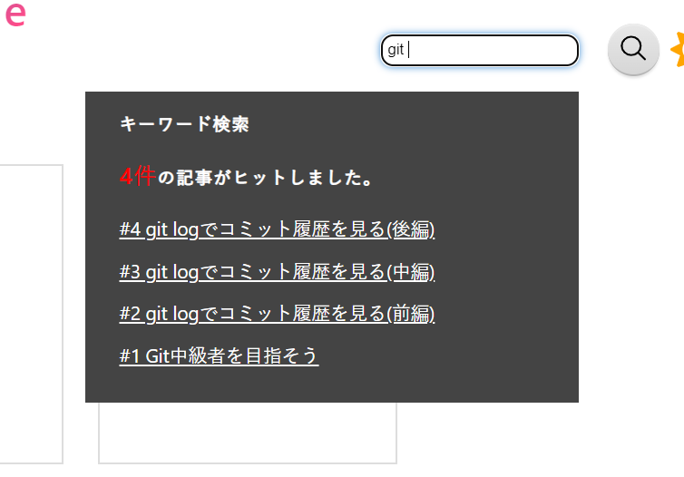
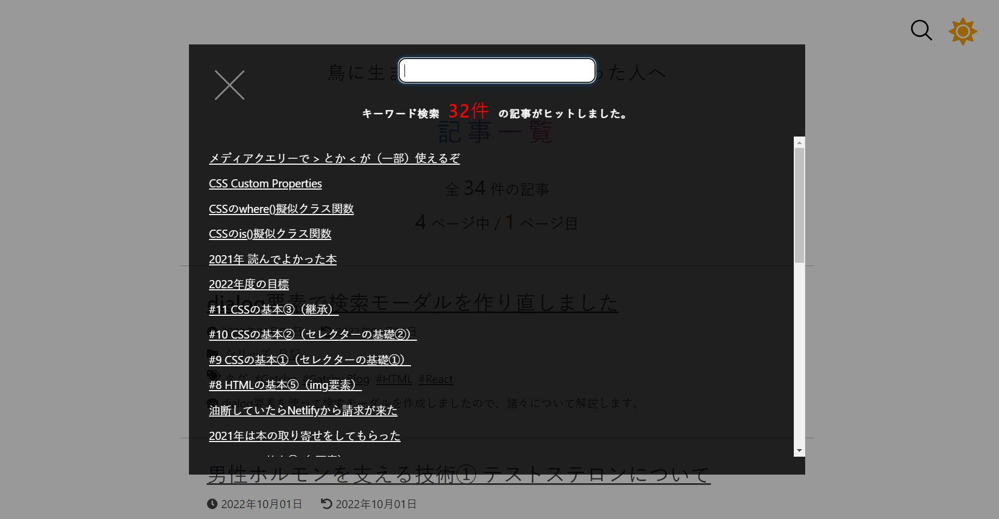

# dialog要素を使用して検索モーダルを実装する

当ブログはキーワード検索機能を実装しているんですが、そのUIがこれまでは



だったのですが、「もうちょっとちゃんとした物にしたい」ということで



こうなりました。

前バージョンではdiv要素を使い、表示/非表示の切り替えは`useState`を使用して行っていましたが、dialog要素を用いればもっとシンプルに実装できそうだったので改修を行いました。以下、**検索モーダル**と呼ぶことにします。

今回の記事は、当ブログでどのように検索モーダルを実装したのか、そしてdialog要素について解説します。

<aside>

実装はReact環境を想定しています。一部、素のJavaScriptでのコード例も記述しています。

</aside>

## dialog要素

今回の話の主役であるdialog要素ですが、[MDN](https://developer.mozilla.org/ja/docs/Web/HTML/Element/dialog)によると、

> HTML の <dialog> 要素は、ダイアログボックスや、消すことができるアラート、インスペクター、サブウィンドウ等のような<mark>対話的コンポーネント</mark>を表します。

ということです。ユーザーが興味のあるキーワードを入力し、その結果が出力される、ということで、検索モーダルも対話的コンポーネントと言えそうですね。

## open属性で表示される

dialog要素は設置するだけでは表示されません。dialog要素に`open`属性を付与する必要があります。

```html:title="app.tsx"
<body>
  <dialog open>
    Dialog area
  </dialog>
</body>
```

これで黒い枠線のモーダルが表示されます。


## `showModal`メソッドを利用する

モーダルは最初から表示されていることはなく、ユーザー操作によって表示されるようになることがほとんど

これを実現するために、dialog要素の`showModal`メソッドを使用します。`showModal`メソッドを使用すればdialog要素に`open`属性を付与することができます。

では早速実装していきます。Reactを使用しているので、要素の取得には`useRef`を使用します。

```jsx