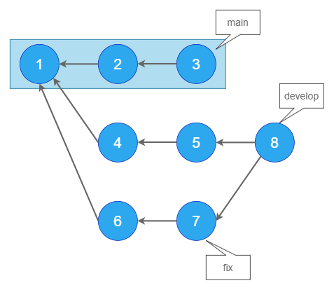
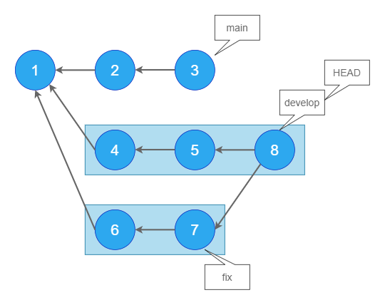
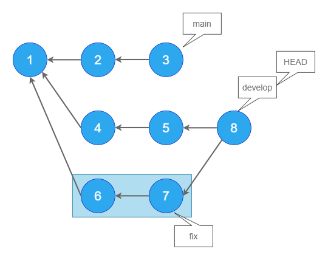
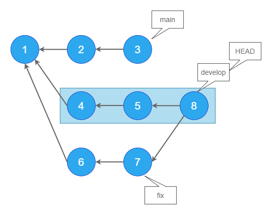
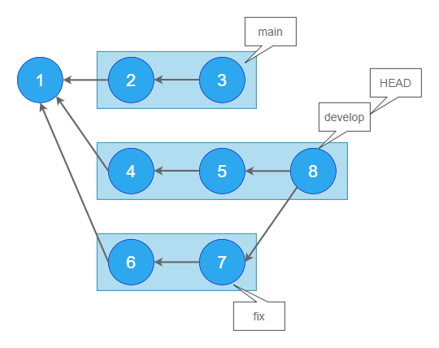
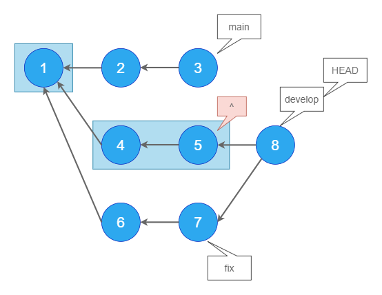

# より詳しいオプションを

前回は`git log`の基本的なオプションを紹介しましたが、今回はもっと掘り下げてより高度なオプションを紹介したいと思います。

<!--特に複数のブランチを考慮したlog出力を重点的に確認したいと思います。-->

前回までは、いわば、ある一つのブランチの中で完結するようなオプションを紹介しました。
複数のブランチが切られている時（というかそれが当たり前ですが）、`git log`と打ってどの範囲のログが出力されるか、正確にわかっていますか？
「あのブランチだけのログが見たいのに、何故か違うブランチのログも出力される。。。」といったことはありませんか？「雰囲気で`HEAD~`とか打ってるけど詳しい意味は分かってない。。。」といったことはありませんか？
たまーに出てくるチルダ(~)やキャレット(^)ですが、どのような意味を持っているかわかっていますか？

~~私もわかっていなかったので~~改めて確認したいと思います。

## その前に参考記事

「ブランチって何？」「HEADって何？」を確認しておきたい方は以下の良記事を読むことをお勧めします。

[GitのHEADとは何者なのか](https://qiita.com/ymzk-jp/items/00ff664da60c37458aaa)

## 2つのブランチを対象にログを出力する

このセクションではダブルドット構文(`..`)とトリプルドット構文(`...`)の使用方法を説明します。

※ダブルドット構文とトリプルドット構文という言葉は公式リファレンスの日本語版ページから引用してます。[こちら](https://git-scm.com/book/ja/v2/Git-%E3%81%AE%E3%81%95%E3%81%BE%E3%81%96%E3%81%BE%E3%81%AA%E3%83%84%E3%83%BC%E3%83%AB-%E3%83%AA%E3%83%93%E3%82%B8%E3%83%A7%E3%83%B3%E3%81%AE%E9%81%B8%E6%8A%9E)

これらの構文は2つの引数(便宜上、引数と呼びます)をとります。

`..`は、**どちらか一方からのみ辿れるコミット**を出力します。結果は引数の渡し順によって変わります。

`...`は、**どちらか一方から辿れるコミット**を出力します。こちらは引数の渡し順によって変わりません。

また、どちらも、**2つのブランチ間で重複しているコミットを除く**動きをします。

---

前提として、リポジトリは以下の状態であるとします。


main、develop、fixという3つのブランチがあります。

青い丸の中の数字はコミットのハッシュIDです。

`8`はdevelopにfixをマージしたマージコミットです。現在HEADはdevelopを指しています。

まずは`git log ブランチ名`と入力したときの出力を確認しておきます。

### git log main

mainブランチである`3`から矢印で辿れる、`3,2,1`が対象です。



### git log develop (git log HEAD)

developブランチである`8`から辿れる、`8,7,6,5,4,1`が対象です。


### git log fix

fixブランチである`7`から辿れる、`7,6,1`が対象です。


---

### git log develop..main

では、`..`の動作を確認します。

言語化するとしたら「developになくて、mainにあるもの」
でしょうか  。

`3,2`が出力されます。

mainから`3,2,1`が辿れますが、`1`はdevelopからも辿れるので対象外です。


### git log main..develop

上記の逆です。読み方は「mainになくて、developにあるもの」。

developから`8,7,6,5,4,1`が辿れますが、`1`はmainからも辿れるので対象外です。



### git log main..fix

読み方は「mainになくて、fixにあるもの」。

fixから`7,6,1`が辿れますが、`1`はmainからも辿れるので対象外です。



### git log fix..develop

読み方は「fixになくて、developにあるもの」。

developから`8,7,6,5,4,1`が辿れますが、`7,6,1`はfixからも辿れるので対象外です。



### git log develop..fix

読み方は「developになくて、fixにあるもの」。

fixから`7,6,1`が辿れますが、これらは全てdevelopからも辿れるのでコミットは出力されません。


---

### git log main...develop (git log develop...main)

ここからは`...`の使用方法です。

`...`は、**どちらか一方から辿れるもの**を出力します。**どちらからも辿れるもの**は対象外です。

上記のコマンドで言うと、読み方は「mainかdevelopのどちらか一方にあるもの」です。

`1`はmainからもdevelopからも辿れるので対象外です。



なお、`...`を使用する場合、どのような順番でブランチを指定しても結果は同じです。

### git log develop...fix (git log fix...develop)

読み方は「developとfixのどちらか一方にあるもの」です。

`7,6,1`はdevelopからもfixからも辿れるので対象外です。


### `--left-only`と`--right-only`を使用する

### `--left-right`を使用する

以上、`..`と`...`の動作を図示しましたが、実際にコンソール上で`git log`した時、わかりやすい出力になっているとは言えないと思います。

```
$ 例

$ git log master...develop --oneline

278da47 (HEAD -> develop) Merge branch 'fix' into develop
64414ae (fix) fix-commit 2
a7c60fc fix-commit
719f9b0 develop-commit 2
84d64bb develop-commit
ad84558 (master) master-commit 3
c2d1404 master-commit 2
```
`--left-right`オプションを渡すと、

## チルダとキャレット

### git log develop~

チルダを付与することで**親のコミット**を取得できます。

この場合、`git log develop~`は`git log 5`と同義と言えます。


### git log develop~~ (git log develop~2) 

チルダを複数つけることで、更に親を辿っていくことができます。また、`~~`は`~2`に置き換えることができます。


### git log develop^




# `git log`ではないけれど

以上、`git log`に関係するオプションを紹介しましたが、`git log`ではないもののコミットログに関係するコマンドをいくつか紹介したいと思います。


## `git shortlog`でユーザごとのコミット履歴を取得する

`git shortlog`で各コミットをコミットを行ったユーザごとに分類して表示します。
以下の例だと、alien:alien:さんが1コミット、potsunenさんが5コミット行ったことが分かります。コミット数でマウントをとりたいときに便利です。

```shell:title=console
$ git shortlog

alien (1):
      edit style.scss

potsunen (5):
      initial commit
      first commit
      second commit
      third commit
      create style.scss
```

| オプション | 意味 |
| --------- | :----- |
|-n|コミット数が多いユーザから表示する|
|-s|コミット数だけを表示する|


```shell:title=console
$ git shortlog -ns
     5  potsunen
     1  alien
```

## `git blame`で変更を行ったユーザを特定する

`sayHello`という関数名を`screamHello`という名前に変更した人がいるとします。「誰や勝手に関数名変えたの...」

```shell:title=console
$ git log -p

bcb5843 (HEAD -> master) Edit script
diff --git a/script.ts b/script.ts
index 4018eac..37504b5 100644
--- a/script.ts
+++ b/script.ts
@@ -1,4 +1,4 @@

-function sayHello(name: string): void {
+function screamHello(name: string): void {
   console.log('hello ' + name)
 }
```

`git blame`コマンドは、*行ごとに*コミットがあった日時、コミッターを表示します。引数にはファイル名を渡してあげてください。

```shell:title=console
$ git blame script.ts

^0f1e08c (potsunen 2020-06-05 11:45:45 +0900 1)
bcb58434 (alien    2020-06-05 11:51:00 +0900 2) function screamHello(name: string): void {
^0f1e08c (potsunen 2020-06-05 11:45:45 +0900 3)   console.log('hello ' + name)
^0f1e08c (potsunen 2020-06-05 11:45:45 +0900 4) }
```

この例で言うと2行目、alienさんが`bcb58434`コミットの時に変更したことが分かります。

なお、blameは「責める、糾弾」などと言った意味です。自分が犯人だった時にはrebase等でもみ消しましょう。

[7.1 Git のさまざまなツール - リビジョンの選択](https://git-scm.com/book/ja/v2/Git-%E3%81%AE%E3%81%95%E3%81%BE%E3%81%96%E3%81%BE%E3%81%AA%E3%83%84%E3%83%BC%E3%83%AB-%E3%83%AA%E3%83%93%E3%82%B8%E3%83%A7%E3%83%B3%E3%81%AE%E9%81%B8%E6%8A%9E)

[Git でブランチ間の差分を調べる](https://maku77.github.io/git/log/diff-between-branches.html)

[GitのHEADとは何者なのか](https://qiita.com/ymzk-jp/items/00ff664da60c37458aaa)