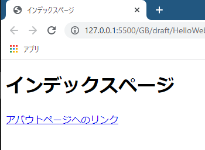

# Webはリンクの集まり

a要素は**リンク**を作成する要素です。他のページへ遷移するものや、同じページ内へ遷移するもの（記事の始まりの目次などに使用されていますね）、また、ファイルをダウンロードするものなどがリンクに辺り、全てa要素を使用して作成します。

## HTMLの由来

HTMLはHyper Text Markup Languageの略称です。このハイパーテキストという言葉についてですが、「ハイパー」とはどういう意味でしょうか。普通のテキストと何が違うのでしょうか。今更ですが、少し考えてみます。

HTMLが生まれたきっかけは、とある研究所での研究論文の紐づけのためでした。研究に必要なデータや参考文献を大量に集め、**各情報を行き来できるリンク**があれば便利ではないかと考えられました。そして、リンクを持つ特別なテキストを**ハイパーテキスト**と呼ぶようになりました。

さらに、リンクのことを**ハイパーリンク**と呼びます。つまり、ハイパーリンクがあるからこそ、ハイパーテキスト（≒HTML）であると言っても過言ではないのです！

インターネットは、無数のハイパーテキストの集まりであり、その中にあるハイパーリンクによって相互に接続されています。

ハイパーリンクを用意してページ間を辿れるようになれば、いよいよWebサイトらしくなってきます。

> ハイパーテキストは、ほかのテキストへのリンクを含むテキストであり、小説のように単一で線形の流れのものとは対照的なものです。

参考 : [Hypertext (ハイパーテキスト) | MDN](https://developer.mozilla.org/ja/docs/Glossary/Hypertext)

> ハイパーリンクはウェブページやデータ項目をお互いに接続します。

参考 : [Hyperlink (ハイパーリンク) | MDN](https://developer.mozilla.org/ja/docs/Glossary/Hyperlink)

## index.htmlとabout.htmlを用意する

今回は2つのHTMLファイル（`index.html`と`about.html`）を用意します。`index.html`は前回までのものを流用してもいいですし、新しく作っても構いません。

そして、2つのファイルは**同じ階層に**作成するようにしてください。

ファイルの内容は以下の通りにしてください。どのファイルのページが表示されているか分かるように、title要素とh1要素の内容を記述します。

```html{6, 9}:title=index.html
<!DOCTYPE html>
<html lang="ja">
<head>
  <meta charset="UTF-8">
  <meta name="viewport" content="width=device-width, initial-scale=1.0">
  <title>インデックスページ</title>
</head>
<body>
  <h1>index.html</h1>
</body>
</html>
```

```html{6, 9}:title=about.html
<!DOCTYPE html>
<html lang="ja">
<head>
  <meta charset="UTF-8">
  <meta name="viewport" content="width=device-width, initial-scale=1.0">
  <title>アバウト</title>
</head>
<body>
  <h1>about.html</h1>
</body>
</html>
```

## aタグでリンクを作成する

まずは`index.html`の中に`about.html`へのリンクを作成してみます。以下の通りに記述してください。

```html:title=index.html
<body>
  <h1>index.html</h1>

  <a href="./about.html">aboutページへのリンクです。</a>
</body>
```

アンダーバーが引かれた青い文字のリンクが作成されているはずです（どのような表示になっているかは、厳密にはブラウザーによります。）。



クリックしてみて、`about.html`へアクセスできるかも確認してください。


## 参考

[&lt;a&gt;: アンカー要素 | MDN](https://developer.mozilla.org/ja/docs/Web/HTML/Element/a)

[HTMLって何だ -- ごく簡単なHTMLの説明](https://www.kanzaki.com/docs/html/htminfo10.html)

[Webはなんで「ウェブ」なの？ 結局ハイパーテキストって何のこと？【第3回】 | 今さら人に聞けないWebの仕組み | Web担当者Forum](https://webtan.impress.co.jp/e/2019/01/09/31234)

[Webってどういう意味？意外と知らないWebの歴史【インターネット・アカデミー】](https://www.internetacademy.jp/special/history.html)

[第12回インターネット講座](http://www.tufs.ac.jp/ts/personal/yamaguci/inet_lec/lec12/98med12.html)