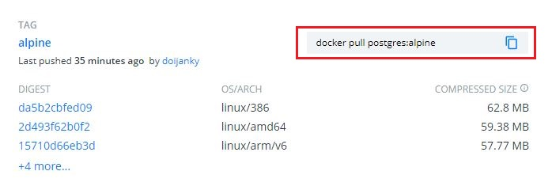

まずはdocker runで起動してみて、所感をつかみます。その後はdocker-compose化します。最後にユーザ名やパスワードを`.env`化します。

# 前提

 - Windows10 64bit 2004
 - Doceker version 20.10.2, build 2291f61
 - dokcerイメージ postgres:12-alpine

## apline版のDockerファイルを落とす

まずはDocker Hubにアクセスし、alpineイメージがあるかを確認しておきます。

[こちら](https://hub.docker.com/_/postgres)から、PostgreSQLのオフィシャルイメージのページにアクセスします。

**Tags**をクリックし、alpineタグがついているものを探します。

見つかったら、コマンド（赤枠で囲っているところ）をコピーします。



では、コンソールでpullコマンドを入力し、イメージを落とします。

```shell
$ docker pull postgres:apline
alpine: Pulling from library/postgres

(略)

$ docker image ls
REPOSITORY    TAG       IMAGE ID       CREATED         SIZE
postgres      alpine    91aed320ad01   5 days ago      160MB
```

せっかくなので、`docker inspect`コマンドでイメージの中身を見てみます。

```shell


```

## コンテナを起動する

カレントコマンドを実行するディレクトリにdataフォルダを作っておきます。


```shell
$ docker run --name postgres --rm -d -p 11111:5432 \
    -v data:/var/lib/postgres/data \
    -e POSTGRES_PASSWORD=decjapan \
    postgres:alpine

$ docker container ls

CONTAINER ID   IMAGE             COMMAND                  CREATED          STATUS          PORTS                     NAMES
3fdd895b7ee7   postgres:alpine   "docker-entrypoint.s…"   14 seconds ago   Up 14 seconds   0.0.0.0:11111->5432/tcp   postgres
```


## docker-compose化する
